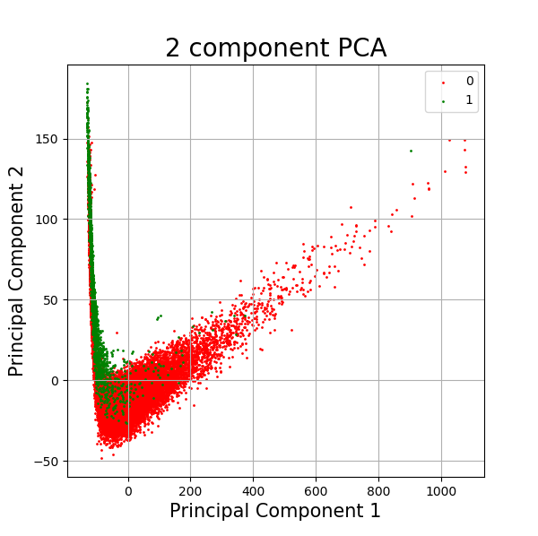
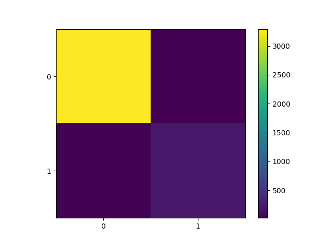

# Predicting-Pulsar-Star-Machine-Learning-
Machine Learning Python Script implementing Support Vector Classifier (SVC) using Gaussian Kernel (RBF). This Model will predict where the observed star is Pulsar or not. 

Dataset Columns :- 1. Mean of the integrated profile, 2. Standard deviation of the integrated profile, Excess kurtosis of the integrated profile, Skewness of the integrated profile, Mean of the DM-SNR curve, Standard deviation of the DM-SNR curve, Excess kurtosis of the DM-SNR curve, Skewness of the DM-SNR curve, target_class - 0 or 1

Report
           -  precision    recall  f1-score   support

           0       0.99      0.99      0.99      3306
           1       0.92      0.84      0.88       274

    accuracy          -         -      0.98      3580
   macro avg       0.96      0.92      0.94      3580
weighted avg       0.98      0.98      0.98      3580

Error - 0.017318435754189943

Confusion Matrix
[[3287   19]
 [  43  231]]
